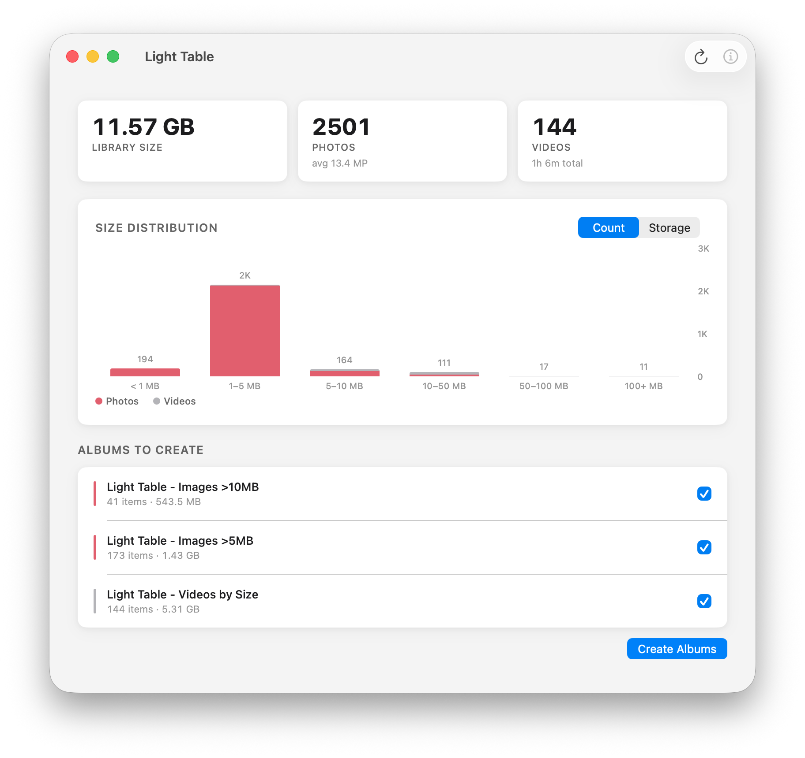
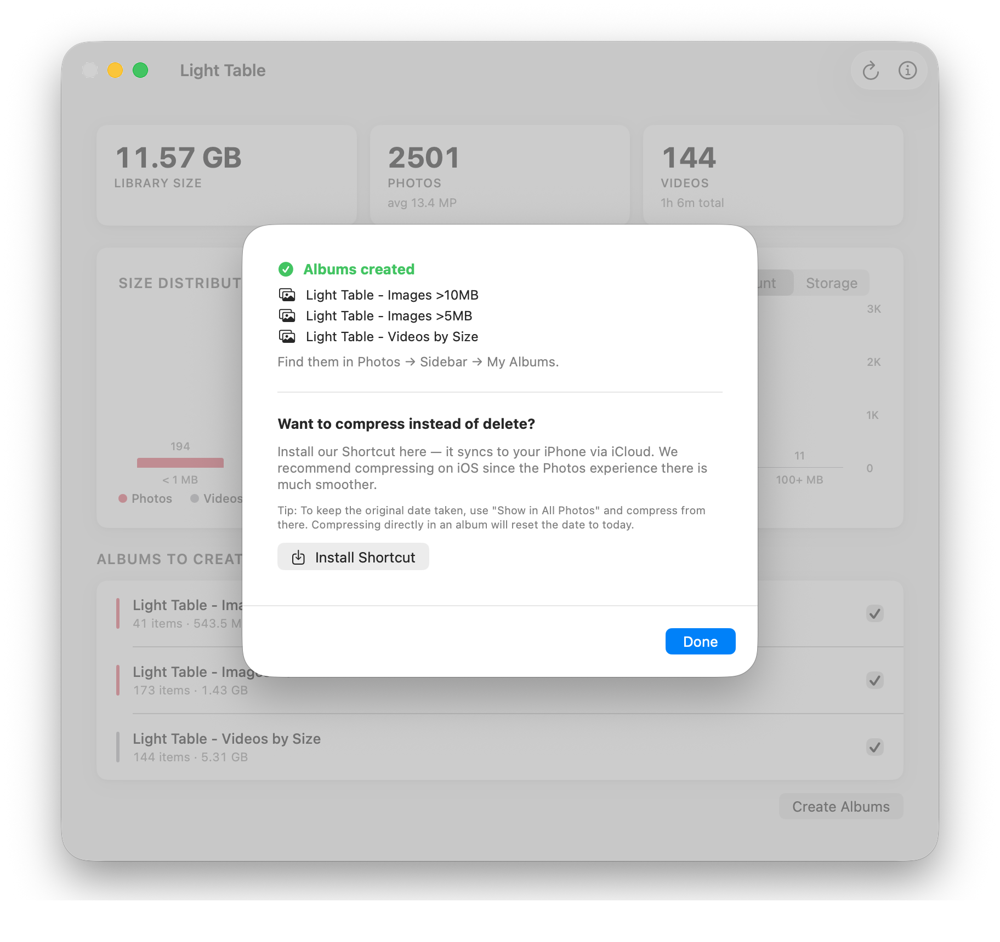

# Light Table

Light Table scans your Photos library and shows which photos take up the most space — sorted by size, finally — so you can reclaim storage on both your Mac and iCloud.

I built this app for myself.

[](https://github.com/saiday/LightTable/releases/latest/download/LightTable.dmg)

<p align="center">
  
</p>

<p align="center">
  
</p>

## Install

Download the latest DMG from [Releases](https://github.com/saiday/LightTable/releases/latest).

## Build from Source

Requires [XcodeGen](https://github.com/yonaskolb/XcodeGen).

```sh
brew install xcodegen
xcodegen generate
open LightTable.xcodeproj
```
